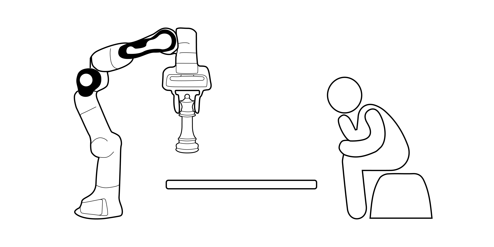
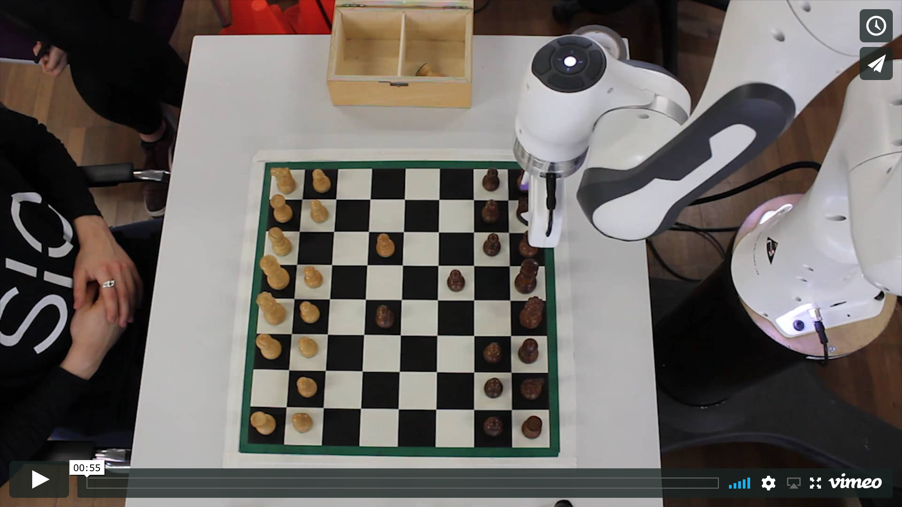
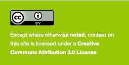

<h1 align="center">
	
  <br>
  Design Engineering Chess Robot
</h1>

<h4 align="center">
  <a href="http://de3-rob1-chess.rtfd.io">View the Project Documentation online</a>
  <br><br>
  
</h4>

<p align="center">
	<sub>Design Engineering, Imperial College London</sub>
</p>
<br>
<p align="center">
	<a href="https://vimeo.com/291377091" >
	</a>
</h1>
<br>

## Group

- Anna Bernbaum ([@AnnaBernbaum](https://github.com/AnnaBernbaum))
- Ben Greenberg ([@nebbles](https://github.com/nebbles))
- Josephine Latreille ([@josephine-latreille](https://github.com/josephine-latreille))
- Sanish Mistry ([@sanish96](https://github.com/sanish96))
- Leah Pattison ([@leahpattison](https://github.com/leahpattison))
- Paolo Ruegg ([@pa17](https://github.com/pa17))
- Sylvia Zhang ([@SylviaZhanggg](https://github.com/SylviaZhanggg))

## Clone the repository

```bash
git clone http://github.com/nebbles/DE3-ROB1-CHESS
```

## Compiling the documentation offline

```bash
cd docs/
make html
open build/html/index.html
```

## Popular source code

* Source code for controlling Franka with Python (uses ROS)

```bash
svn export https://github.com/nebbles/DE3-ROB1-CHESS/trunk/franka/franka_control_ros.py
```

* Source code for converting between reference frames

```bash
svn export https://github.com/nebbles/DE3-ROB1-CHESS/trunk/tools/transform.py
```


