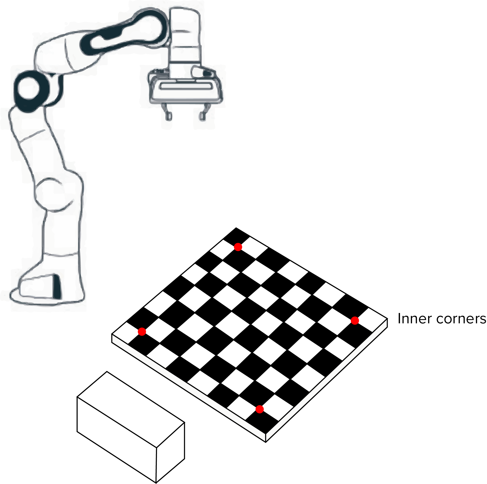
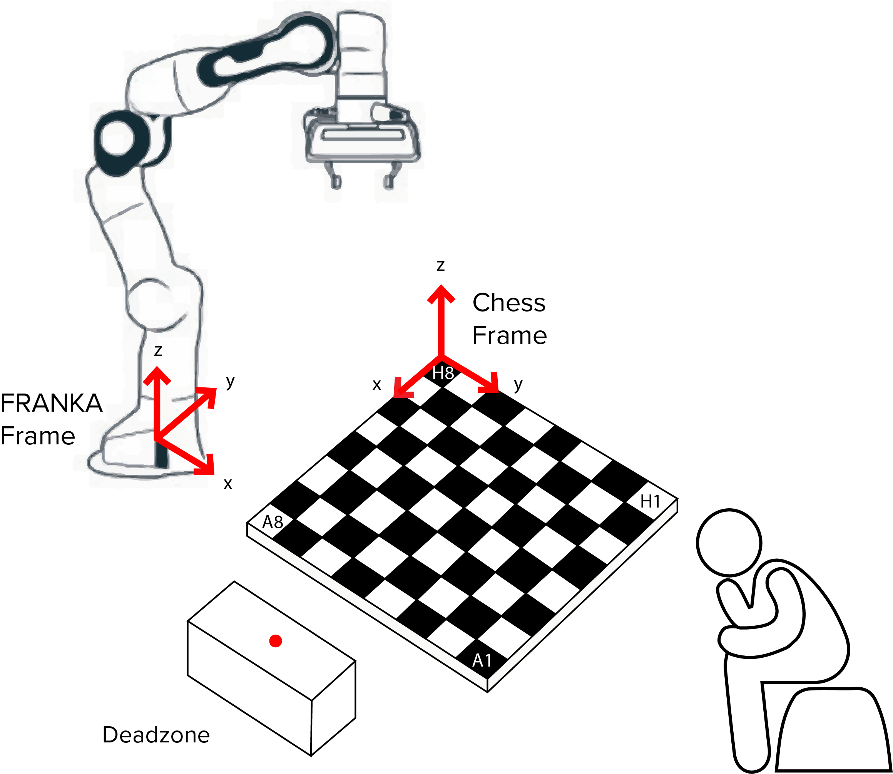
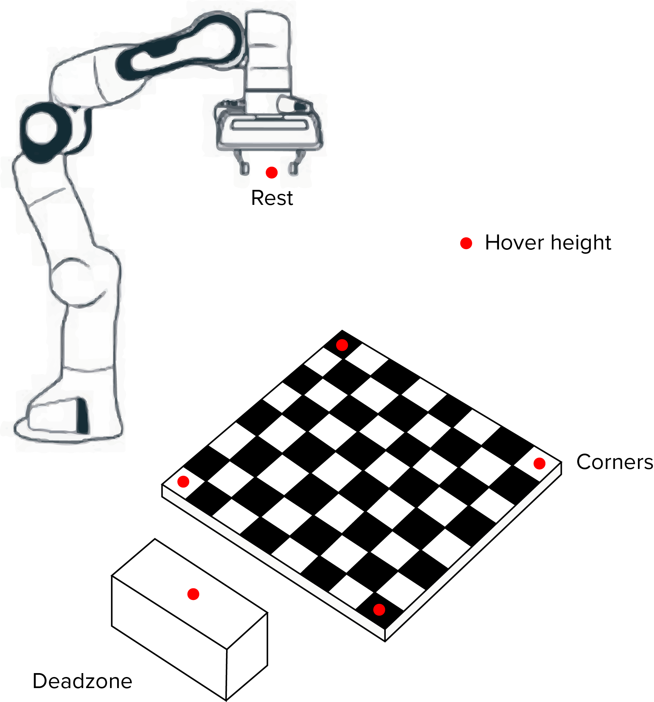
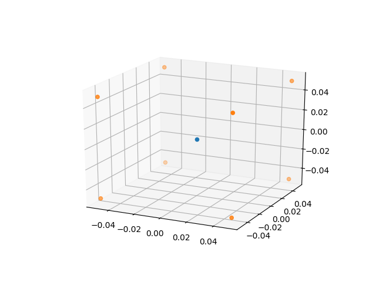
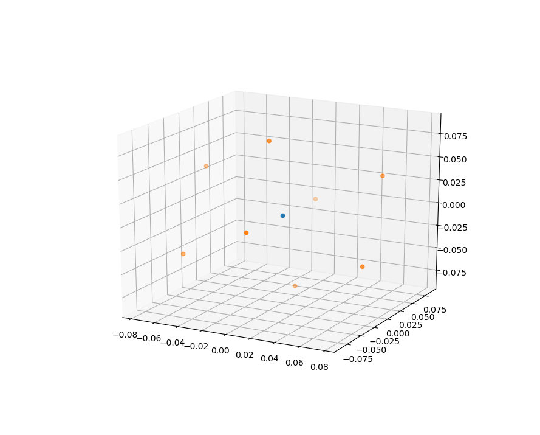
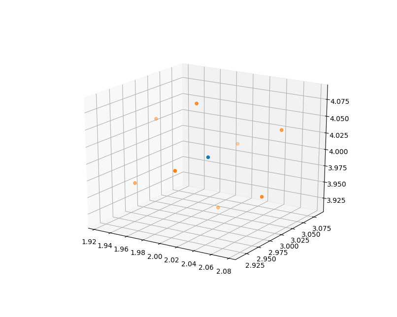
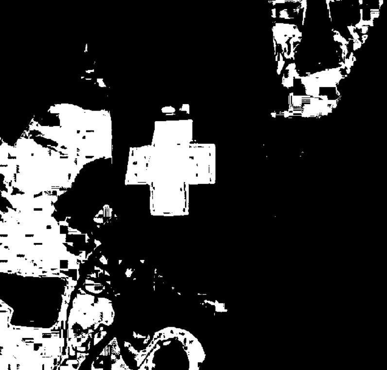
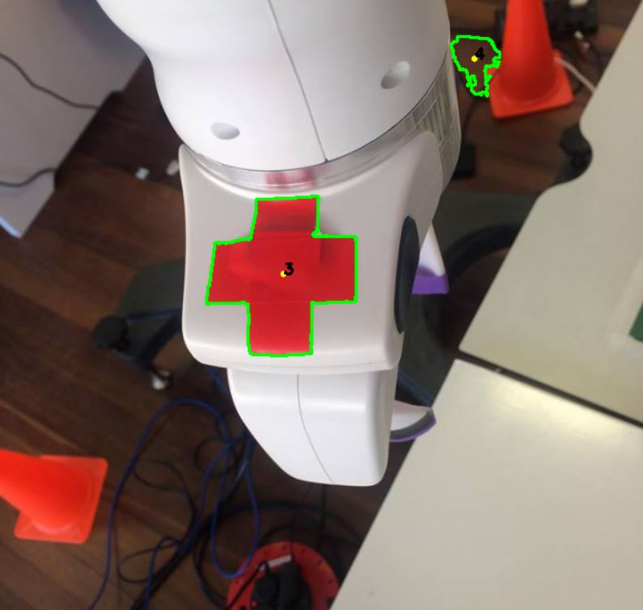
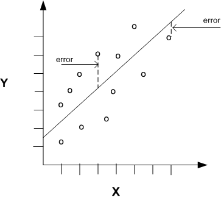

***********
Calibration
***********

Calibration allows coordinates to be sent to FRANKA in it's own reference frame for it to move to. By callibrating FRANKA, a conversion can take place between an alternative frame of reference to FRANKA's. Both manual and automated methods of doing this were devised.

To use our reference frame conversion code, use the following command in the terminal when in the directory you want it copied to::

  svn export https://github.com/nebbles/DE3-ROB1-CHESS/trunk/tools/transform.py

Manual Calibration
==================

In the interim before having complete automatic calibration, we used manual calibration to determine the position of the board relative to the FRANKA base frame. The FRANKA end-effector was moved to each of the inner corners as shown below and the positions reported by the FRANKA were then hardcoded.

When the ``MotionPlanner`` class is instantiated, the calibration is automatically taken from the hardcode values in our ``__init__`` function. In an automatic version, the hardcoded values would be replaced by coordinates gathered by the calibration procedure.

4 vectors are calculated from this information, along the x and y axis of the board:

- *x axis 1:* H8 to A8
- *x axis 2:* H1 to A1
- *y axis 1:* H8 to H1
- *y axis 2:* A8 to A1

The x and y vectors are averaged respectively to give overall x and y directional vectors.
These are then divided by 6 to give x and y unit vetors equivalent to a single board square.
The H8 coordinate is stored and used as the starting point for all future location calculations.

The minimum z value of the board is hardcoded when manually moving the end-effector around. This value is then used to hardcode a hover height, rest position and deadzone location as global variables.

Derived positions:

The coordinates of each square on the board are stored using 2 dictionaries, one for the numbers and one for the letters in algebraic notation. These locations are found by multiplying the unit vectors appropriately. For example, ``f`` is found by adding 2.5 times ``x_unit_vector`` to the H8 coordinate.

.. literalinclude:: ../../motion.py
   :lines: 87-105

Hardcoded width values were used for the gripping width, whilst the ``board_z_max`` was used to derive the correct height at which to pick up each piece.

Automated Calibration
=====================

To advance beyond the manual hardcoded approach described above, a system was devised whereby the FRANKA end-effector could be placed in the centre of the field of view of the camera, allowing it to automatically calibrate itself from predetermined controlled motions.
To calibrate the chess board, image recognition techniques described in the Perception module were used to relate the Franka base frame to the camera. A trackable marker located on the robot end-effector allowed the camera to locate the arm in space as it moved between 8 vertices of a cube (built around the starting position of the end-effector).

The ``generate_cube`` function generates an array of 9 ``x, y, z`` coordinates for calibration based on an end-effector (1 x 3 array) input position followed by the 8 coordinates of the each vertex of the cube.

Generating a cube
-----------------

The generate_cube function generates an array of 9 ``x, y, z`` coordinates for calibration based on an end-effector (1 x 3) input position followed by the 8 coordinates of the each vertex of the cube.
An array is created about ``(0, 0, 0)`` of edge length 0.1 metres.

This array is then multiplied by 3 transformations matrices rotating it by 30 degrees in the x, y and z axes producing an 8 x 3 array of the transformed cube about ``(0, 0, 0)``. When creating a transformation matrix between two frames, all of the points in the robotic frame need to be different in all three axes. If there are duplicates (say 4 points are planar on x-y) then we start accumulating errors in the transformation matrix. See `Converting between Reference Frames`_ later for more information on the transformation matrix.

.. literalinclude:: ../../calibration.py
   :lines: 60-62

This array is then multiplied by 3 transformations matrices rotating it by 30 degrees in the x, y and z axes producing an 8x3 array of the transformed cube about ``(0, 0, 0)``. This is because when creating a transformation matrix between two frames we need each of our points in the robotic frame to be different in all three axes. If there are duplicates (say 4 points are planar on x-y) then we start accumulating errors in our transformation matrix. See `Converting between Reference Frames`_ later for more information on the transformation matrix.

A ``for`` loop was used to add each row of the array to the x, y, z end-effector positions offseting the transformed cube by the current FRANKA end effector position. These are appended to the ``cube_output`` array.

.. literalinclude:: ../../calibration.py
   :lines: 80-91

A for loop is used to add each row of the array to the x, y, z end-effector positions to offset the transformed cube by the current FRANKA end effector position. These are appended to the ``cube_output`` array.

Various markers including LEDs and ARUCO markers were trailled first. These were superceded once it was identified that a simple red cross marker was effective for the camera to detect. This was due to the good colour contrast between the marker and the rest of the frame, allowing a shape to be distinguished.
OpenCV was used to detect the shape and colour of the marker. The ``detect`` function was used to find the area, perimeter and the number of sides of all the polygons found in a frame.

.. literalinclude:: ../../calibration.py
   :lines: 93-99

Detecting the Marker
--------------------

Various markers including LEDs and ARUCO markers were tried first. These were superceded once it was identified a simple red cross marker was effective for the camera to detect. This was because the colour often had good contrast with the rest of the frame and therefore a shape could be easily distinguished.
OpenCV was used to detect the shape and colour of the marker. The detect function was used to detect the area, perimeter and the number of sides of all the polygons found in a frame.
To prevent detecting all polygons in the frame, the frame is resized and filtered for the red colour desired. The frame was converted from RGB to HSV to aid extracting objects of specific colour; this was done using a mask over a specific range of HSV values.

The detect function was used in the ``find_cross_manual`` and ``find_cross_auto`` functions. Parameters based on the number of sides, the total area and perimeter of the detect polygons were used to filter out other shapes and ensure that the red cross marker was detected.

.. literalinclude:: ../../calibration.py
   :lines: 134-144

Image moments were used to find the ``x, y`` coordinates of the centre of the shape, which are returned.
To prevent detecting all polygons in the frame, the frame is resized and filtered for the red colour we desire. The frame was converted from RGB to HSV to aid extracting objects of specific colour; this was done using a mask over a specific range of HSV values.

.. literalinclude:: ../../calibration.py
   :lines: 166-184

The detect function was used in the find_cross_manual and find_cross_auto functions. Parameters based on the number of sides, the total area and perimeter of the detect polygons were used to filter out other shapes and ensure that the red cross marker was detected.

.. literalinclude:: ../../calibration.py
   :lines: 189

Image moments are used to find the x, y coordinates of the centre of the shape, which are returned.

.. literalinclude:: ../../calibration.py
   :lines: 191-193

Automatic vs Manual Marker Detection
------------------------------------

The manual detection method allows users to double check that if one marker is detected that the correct one has been selected, and if multiple detectors are selected they are able to enter the number of the correct marker.
In the automatic mode the detected marker is automatically returned, however if multiple are detected they are able to switch to manual mode.

Find Depth
----------

The ``find_depth()`` function returns the RGB value of a pixel at coordinates x, y on a frame. Only the first value in the list is required since this function is used on a greyscale depth frame.
The ``run_calibration()`` function runs the calibration functions moving the end-effector between the 8 vertices of the cube (x, y, z), then detecting the marker at each of these 8 steps, applying the marker offset and producing the array of u, v, w positions (coordinates in the camera frame).

.. literalinclude:: ../../calibration.py
   :lines: 320-332

Marker Offset
-------------

A hardcoded offset value is measured to adjust the perception u, v, w of the detected marker to the position of the end-effector of the robot. This is since the marker is not placed exactly at the position where FRANKA records its x, y, z end effector positon.

Running Calibration
-------------------

The ``run_calibration()`` function runs the calibration functions moving the end-effector between the 8 vertices of the cube (x, y, z), then detecting the marker at each of these 8 steps, applying the marker offset and producing the array of u, v, w positions.

Converting between Reference Frames
-----------------------------------

Overview
--------

To be able to convert camera coordinates, provided by OpenCV tracking tools and other methods, a relationship between multiple reference frames needs to be maintained. The desired relationship relates the camera reference frame and the robot base reference frame used by the libfranka controller. This relationship is stored in a 4-by-4 transformation matrix, and is constructed using the following general formula:

.. math::

  aX = b

This is modelled on the idea that a coordinate in the main frame (e.g. RGB-D camera provides ``u, v, w`` coordinates) and converts it to the equivalent, corresponding coordinate in the robots reference frame (e.g. ``x, y, z``) so that the robot can move to that point on the camera's view. ``a`` represents our camera coordinate, and ``b`` represents the output of our function, that mulitplies ``a`` with our transformation matrix ``X``, which represents the same point but on the robots reference frame.

.. figure:: _static/reference_frame_camera.png
    :figwidth: 20 em
    :align: center
    :figclass: align-center

Creating the transformation matrix
----------------------------------

To create the transformation matrix, you construct a set of linear equations that are then solved using a simple least squares algorithm, commonly used in linear regression. This algorithm tries to minimise the sum of squares for each solution to the set of linear equations.

This set of linear equations is constructed using *calibration points*. These points (usually a minimum of 4) are a set of known, corresponding coordinates in both the cameras reference frame and the robots. These can be automatically sourced with a setup program, or manually. To manually get these points, the robots end effector are moved to a point in the field of view of the camera, and the robot would report its position (``x, y, z``). The camera would then detect the robot end effector in the field of view and report the location according to its own reference frame (``u, v, w``) and so these two points are the same point (they correspond) but are in different reference frames. A minimum of 4 calibration points are collected, ideally up to 8 or 10 because this will increase the accuracy of the transformation matrix, as there may have been a small error in the values reported by the camera or robot.

The calibration equation (of *n* calibration points) can now be solved for the unknowns in the transformation matrix, *X*.

.. math::

  \begin{bmatrix}
    u_i&v_i&w_i\\
    &\vdots&\\
    u_n&v_n&w_n
  \end{bmatrix} X =
  \begin{bmatrix}
    x_i&y_i&z_i\\
    &\vdots&\\
    x_n&y_n&z_n
  \end{bmatrix}

Where :math:`m_{ij}` is the unknown in *X*,

  .. math::

    X =\begin{bmatrix}
      m_{11}&m_{12}&m_{13}&m_{14}\\
      m_{21}&m_{22}&m_{23}&m_{24}\\
      m_{31}&m_{32}&m_{33}&m_{34}\\
      m_{41}&m_{42}&m_{43}&m_{44}
    \end{bmatrix}

In MATLab, the function for solving this equation is simply ``X = a\b``, or less commonly written as ``X = mldivide(a,b)``. `The mldivide() function`_ in MATLab is a complex one, and utilises many different possible algorithms depending on its inputs. To get the similar behaviour in Python, the `numpy's lstsq function`_ is used. It has similarites and differences which have been discussed `{1}`_ `{2}`_, but ultimately provides the same functionality of returning a least square solution to the equation. The function is used as in our example below::

  import numpy as np
  from numpy import random

  num_pts = 4

  A = random.rand(num_pts, 3)
  one = np.ones((num_pts, 1))
  A = np.column_stack([A, one])
  print("A", A)
  print("\n")

  T = random.rand(3, 4)
  xrow = np.array([0,0,0,1])
  T = np.vstack([T, xrow])
  print("T", T)
  print("\n")

  B = np.dot(A, T)
  print("B", B)
  print("\n")

  x = np.linalg.lstsq(A, B, rcond=None)[0]
  print("x", x)

.. _`The mldivide() function`: http://uk.mathworks.com/help/matlab/ref/mldivide.html
.. _`numpy's lstsq function`: https://docs.scipy.org/doc/numpy/reference/generated/numpy.linalg.lstsq.html

.. _`{1}`: https://stackoverflow.com/questions/33559946/numpy-vs-mldivide-matlab-operator
.. _`{2}`: https://stackoverflow.com/questions/33614378/how-can-i-obtain-the-same-special-solutions-to-underdetermined-linear-systems?noredirect=1&lq=1

Implementation
--------------

.. automodule:: tools.transform
  :members:
  :undoc-members:
