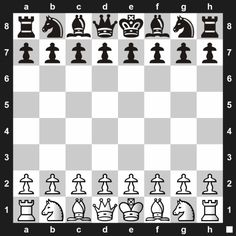
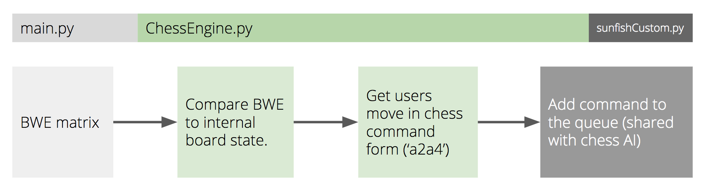

************
Chess Engine
************

Description
===========

The chess engine is an interface to any chess AI chosen. This project uses
`sunfish by thomasahle`_ as the chess AI of choice. The chess engine spins up an instance of the
sunfish program, and then sends the users plays to the AI. The AI then responds with
what it decides should be the computer/robots move. To do this, some small modifications
had to be made to the sunfish source code:

* Add a wait loop for the command queue to be filled with the user's response. Inform the engine if the move is invalid or not.

.. literalinclude:: ../../chess/sunfish_custom.py
   :lines: 449-464

* Inform the game engine if the user's move caused them to win.

.. literalinclude:: ../../chess/sunfish_custom.py
  :lines: 466-475

* Send whether the computer won or not. Also, send the computers move back to the chess engine through a seperate queue.

.. literalinclude:: ../../chess/sunfish_custom.py
   :lines: 480-490

These minimal changes mean that any AI that takes a users input as a chess command
(e.g. 'a2a4') can be modified with minimal code to work with our chess engine.

.. _`sunfish by thomasahle`: https://github.com/thomasahle/sunfish

Design
======

The CE (chess engine) is written by the team, it can provide all the
chess functionality needed.

.. tip::
  Lower case letters represent black pieces (p,r,n,b,k,q), and upper case letters represent white pieces (P,R,N,B,K,Q). This follows the model used in *sunfish*.

The BWE matrix provided by the Perception module is taken. This Black-White-Empty
matrix is simply a list of strings which represent each square on the board. The elements on the list correspond to the positions on the board as ``[A8, B7, C7, ..., F1, G1, H1]``. For the image below, this would be: ``['B','B','B',...,'W','W','W']``.

This matrix is compared with an internally stored matrix in the CE. This means the CE can
understand:

* where the piece moved from
* where it moved to

and construct a chess command from it. This BWE matrix is of course checked for logical inconsistencies by measuring the change in number of black, white or empty squares in a single turn. Now that a potential chess move has been obtained, it is added to the command queue, a shared resource that both the CE and the chess AI (sunfish) have access to.

.. hint::
  Moving pawn piece A2 to A4 at the beginning of the game would require command 'a2a4'

This move is trialled internally on the AI, and it responds with a number of options.

* The move is invalid, in which case reporting of an illegal move back to the user needs to be carried out
* The move is valid and has caused the user to win, in which case the user should be told
* The move is valid and the computer responds with move (which may be a checkmate)

If the computer replies with a move, it will put it on the reply queue which is shared with the CE. The CE must now understand exactly what the chess AI is asking of it. It will have received a command such as 'n, b1c4' (i.e. knight b1 to c4). The CE then splits this command into the start and end position of the move. It then converts these positions into indices, which it uses to search its internally stored board for the type of piece that is moving. In addition it checks if there is already a piece existing at the end position.

The CE first updates its internal board to remember the move the computer just made, then returns the following information to the caller (function):

* Firstly, if there is a piece to be killed, its location and type.
* Then, the start location of the piece moving, and its type.
* Finally, the end location of the piece moving.

Limitations
===========

The chess engine has limitations, which could be implemented in later versions:

* No support for pawn piece conversion (bringing pieces back onto the board).
* No support for special chess moves such as castling.

Implementation
==============

**Example usage**::

  from chess.engine import ChessEngine

  bwe_list  # Get BWE from the camera

  engine = ChessEngine()
  code, result = engine.input_bwe(bwe_list)

  if code == -1:
      print("There was a problem with the BWE matrix")
  elif code == 0:
      print("Invalid move by user: ", result)
  elif code == 1:
      print("The user won the game")
  elif code == 2:
      print("The computer has won the game", result)
      franka_move(result)
      franka_celebrate()
  elif code == 3:
      print("The computer's move is: ", result)
      franka_move(result)
  else:
    print("Error code not recognised: ", code)

**Documentation**:

.. automodule:: chess.engine
  :members:
  :undoc-members:
