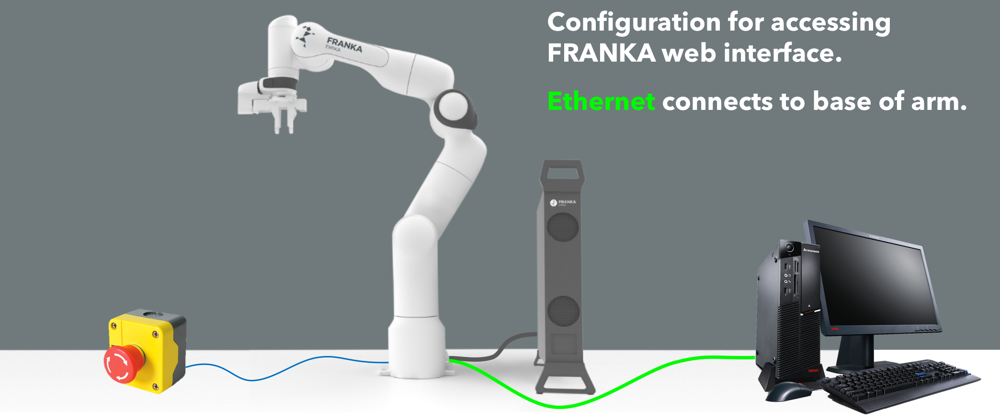

**********
Franka Arm
**********

Starting up
===========

The Arm should be connected to the workshop floor controller with the thick black cable and the controller box should be powered up. When booting, the arm LEDs will flash yellow. Once the arm is booted (solid yellow when completed) you can release the brakes via the web interface.

.. figure:: _static/franka_wiring_guide_general.png
    :align: center
    :figclass: align-center

    Wiring configuration for using the Franka.

Log into the controller web interface (http://192.168.0.88) with:

* Username: ``robin``
* Password: ``panda``

.. note:: Your browser may say the connection is not secure, or some other warning. If this is the case, click on the 'advanced' button, and then click 'proceed anyway'.

To release the brakes on the web interface:

#. Make sure the external activation device (EAD) is pressed down.
#. On the web interface, bottom right, *open* the brakes.
#. There will be a clicking noise from the arm.
#. Release the EAD button and the LED light should be solid white. This means the Arm is ready to be used.

.. attention::
  The white light means the robot is in movement mode. The external activation device (EAD) / button is a software stop. It 'detaches' the arm from the controller which causes the arm to lock (yellow light on). It is **not** an emergency stop, as it does not cut power to the arm/controller.

With the Arm in movement mode, it can be manually manipulated by squeezing the buttons at the end effector. The buttons have a two stage press, and if you press too hard on the buttons, the arm will lock again. The Arm will automatically go into gravity compensation mode when manually moving it.

.. tip:: If the end-effector has recently been removed or readded, the gravity compensation may not be performing well. This is because the web interface settings have not been updated to account for the decrease/increase to expected weight. See the section on `Removing or adding the Franka's end-effector (hand)`_.

.. note::
  When designing motion controllers, we are recommended to use impedance control, not high gain control. This will mean we can reduce the stiffness of the arm when moving making it safer for collaborative environments.

Networking information
======================

If you now want to use a workstation computer to control the Arm via the FRANKA Control Interface (FCI) libraries, **first ensure you have completed the above steps to unlock the Arm brakes**. Also check the ethernet cable is attached either to a network switch or directly to the shop floor controller.

.. attention::
  According to `FRANKA documentation <https://frankaemika.github.io/docs/getting_started.html#operating-the-robot>`_: "the workstation PC which commands your robot using the FCI must always be connected to the LAN port of Control (shop floor network) and **not** to the LAN port of the Arm (robot network)."

With the main workstation computer *should* have a static IPv4 address for the computer in the Ubuntu network settings. The recommended values are seen below:

=======================  ============  ==============================
Device                   IP Address    Notes
=======================  ============  ==============================
FRANKA Arm               192.168.1.0   This does not change
Shop floor (controller)  192.168.0.88  This does not change
Workstation (main)       192.168.0.77  Should be static (in settings)
=======================  ============  ==============================

.. important::
  It is important to note that the IP address of the FRANKA Arm and shop floor controller are static and **should not be changed**. Use this table as reference.

You can confirm that the workstation computer is able to communicate with the workshop controller by pinging the IP address from the terminal::

  $ ping 192.168.0.88

.. note:: Communicating with the Franka over the switch with a static IP does allow you to have internet access, just note that the gateway and DNS settings should be provided in the Ubuntu settings accordingly to make it work.

Removing or adding the Franka's end-effector (hand)
===================================================

To remove or add the hand, first shutdown the arm completely. Secure/remove the hand using both screws and the attach/detach the interface cable.

Once the robot has restarted, go to the **Settings** in the web interface, go to **End effector** and set both the hand drop-down menu and toggle the gripper.

.. _franka-emika-software:

Franka Emika Software
=====================

Software updates can be found at: http://support.franka.de/

The software versions currently used in the robotics lab are:

=======================  ============  ==============================
Software                 Version       Notes
=======================  ============  ==============================
Franka Firmware          1.0.9         Supports ``libfranka < 0.2.0``
ros-kinetic-libfranka    0.1.0         Current ROS version is 0.2.0
franka_ros               ??            Currently unused
=======================  ============  ==============================

.. warning:: The lab only supports libfranka 0.1.0 which is currently unavailable from ``apt install``. **Do NOT uninstall ROS or libfranka on workstations which already have it installed**.

Shutting down the Arm
=====================

Enter the web interface for the Arm. In the lower right menu, lock the brakes. Then in the top right menu, select shutdown, and confirm.

.. important::
  Remember to shutdown the controller from the web interface. This device is a computer, and should not be switched off from mains.

Appendix
========

In rare cases, you may need to access the Franka arm directly by connecting the ethernet cable as seen in the image below:

    Wiring configuration fo accessing the Arm directly (through the web interface).

Log into the controller web interface (http://robot.franka.de) with:

* Username: ``robin``
* Password: ``panda``
