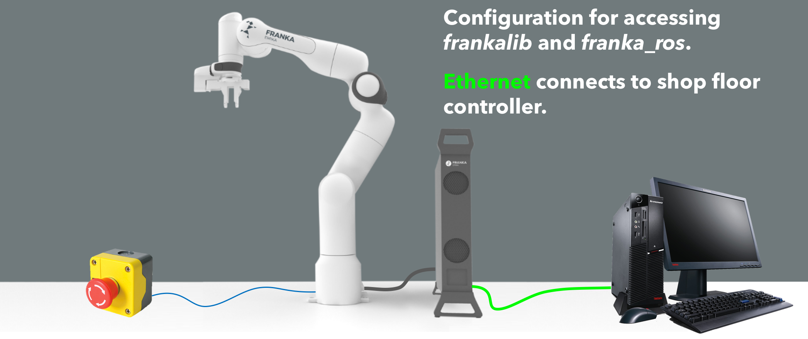

************
FRANKA Panda
************

Starting up the Panda
=====================

The Panda arm should be connected to the workshop floor controller and powered up. When booting, the arm LEDs will flash yellow. Once the arm is booted (solid yellow when completed) you should release the brakes by connecting a computer via ethernet to the base of the arm (see image).

.. figure:: _static/franka_wiring_guide_robot_arm.png
    :align: center
    :figclass: align-center

    Configuration of wiring for connecting to the FRANKA web interface.

Log into the controller web interface (http://robot.franka.de) with:

* Username: ``robin``
* Password: ``panda``

To release the brakes:

#. Make sure the external activation device (EAD) is pressed down.
#. On the web interface, bottom right, *open* the brakes.
#. There will be a clicking noise from the arm.
#. Release the EAD button and the LED light should be solid white. This means the Arm is ready to be used.

.. attention::
  The white light means the robot is in movement mode. The external activation device (EAD) / button is a software stop. It 'detaches' the arm from the controller which causes the arm to lock (yellow light on). It is **not** an emergency stop, as it does not cut power to the arm/controller.

With the Arm in movement mode, it can be manually manipulated by squeezing the buttons at the end effector. The Arm will automatically go into gravity compensation mode when manually moving it.

.. note::
  When designing motion controllers, we are recommended to use impedance control, not high gain control. This will mean we can reduce the stiffness of the arm when moving making it safer for collaborative environments.

Networking with Panda
=====================

If you now want to use a workstation computer to control the Arm via the FRANKA Control Interface (FCI) libraries, **first ensure you have completed the above steps to unlock the Arm brakes**. Then move the ethernet cable from the base of the Arm, and connect it to the shop floor controller (as seen in image).

    Configuration of wiring for connecting to the FRANKA Control Interface (ROS libraries).

.. attention::
  According to `FRANKA documentation <https://frankaemika.github.io/docs/getting_started.html#operating-the-robot>`_: "the workstation PC which commands your robot using the FCI must always be connected to the LAN port of Control (shop floor network) and **not** to the LAN port of the Arm (robot network)."

With the workstation computer connected to the shop floor controller, you must set a static IPv4 address for the computer in the Ubuntu network settings. The recommended values are seen below:

=======================  ============  ==============================
Device                   IP Address    Notes
=======================  ============  ==============================
FRANKA Arm               192.168.1.0   This does not change
Shop floor (controller)  192.168.0.88  This does not change
Workstation              192.168.0.77  Should be static (in settings)
=======================  ============  ==============================

.. important::
  It is important to note that the IP address of the FRANKA Arm and shop floor controller are static and **should not be changed**. Use this table as reference.

You can confirm that the workstation computer is able to communicate with the workshop controller by pinging the IP address from the terminal::

  $ ping 192.168.0.88

.. note:: Communicating with the Panda does not currently work over a network switch. The ethernet cable should be direct from shop floor controller to workstation computer. Unfortunately this means you computer will not be able to connect to the internet.

Panda Software
==============

The FRANKA Panda currently has ``v1.0.9`` which supports versions ``libfranka < 0.2.0``. Updates for the Panda can be found at: http://support.franka.de/
