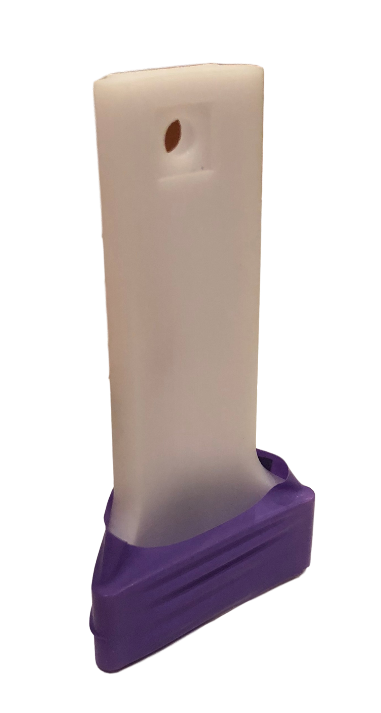
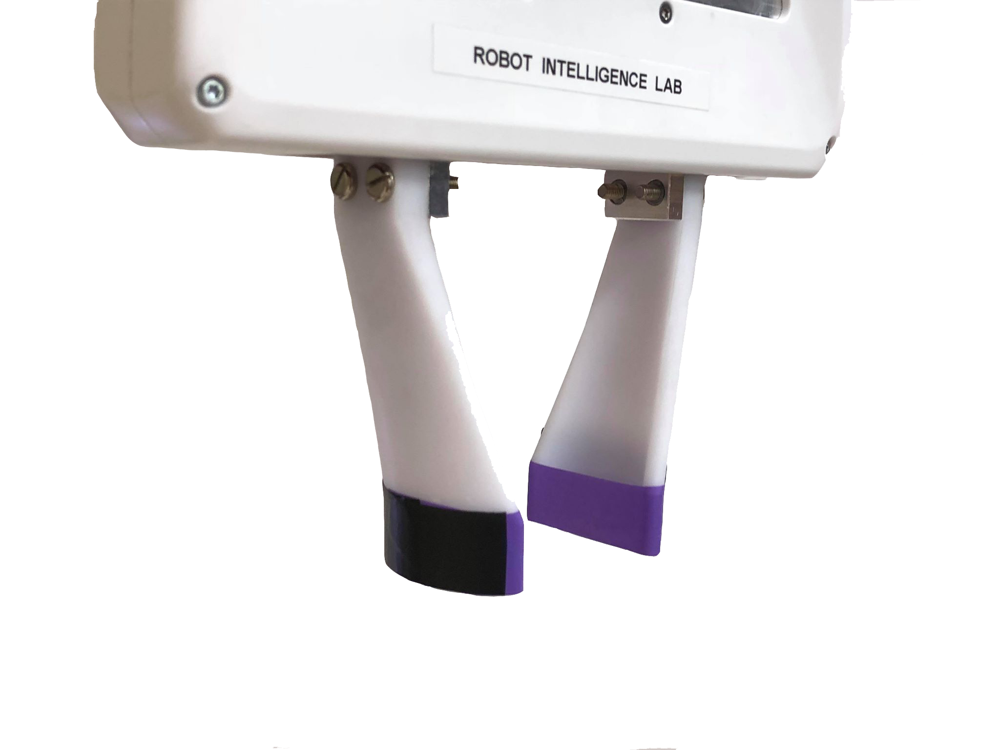
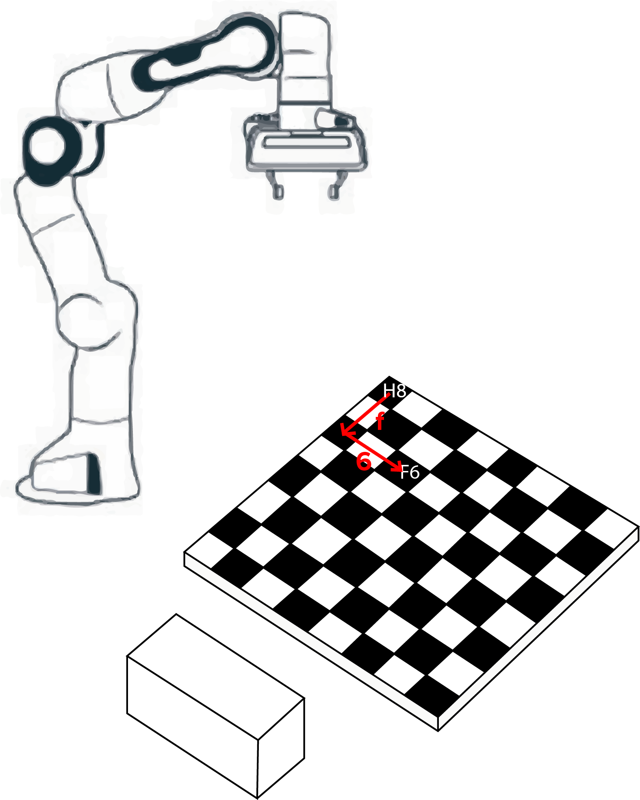
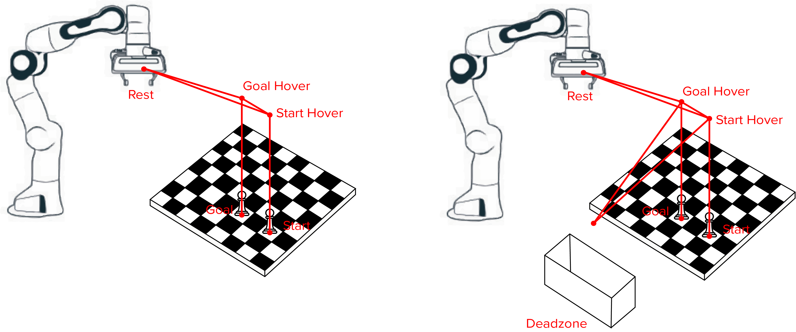
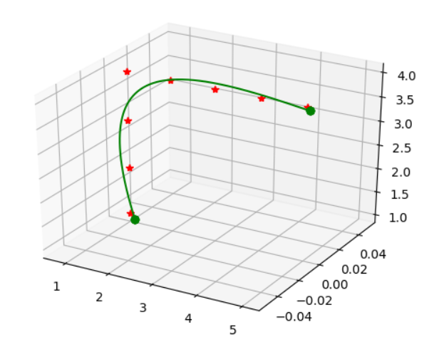
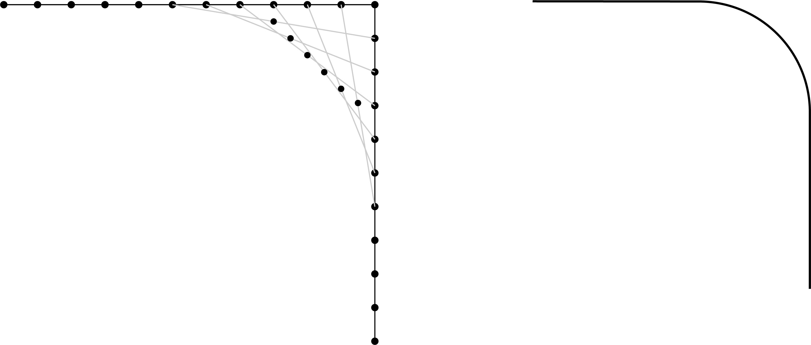
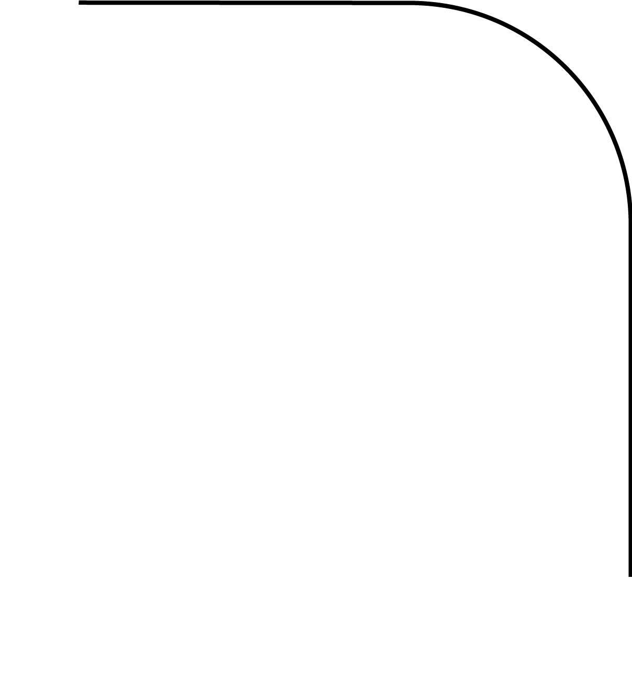
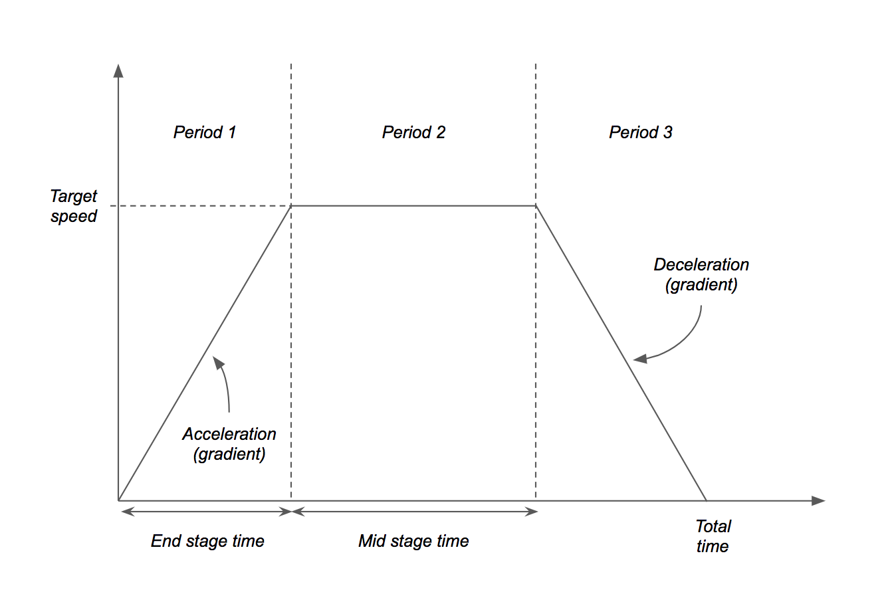
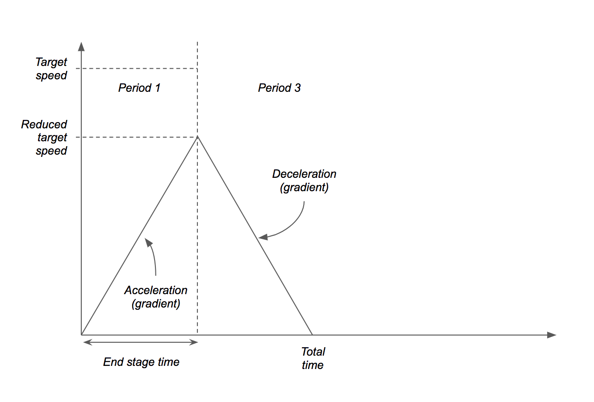

******
Motion
******

Description
===========

This part of the project is responsible for providing the FRANKA arm with instructions on when and where to move. It takes in the algebraic notation (AN) of the start and end locations of the desired move, and then generates a motion plan to be sent to FRANKA for execution.

Grippers
========

Specialised grippers were designed to pick up the chess pieces.

**Iteration 1:**

A compliant design was used which allowed the grippers themselves to deform slightly when each piece was gripped. This allowed the uneven bumps of some pieces to be successfully gripped. They were 3D printed on the ProJet printer and then material from disposable silicone gloves was used to create the pads.

**Iteration 2:**

Small updates were made to the original design for the final versions. A taper angle was added to accomodate for pieces that are wider at the top than lower down. The width of the compressible part was increased to improve grip.

Generating the Trajectory
=========================

Firstly, the start and goal positions of the piece are converted from algebraic notation (AN) to ``x, y, z`` coordinates in FRANKA's reference frame. The AN is extracted from the output of the game engine, along with the piece type (king/queen etc). The conversion from AN is done by finding the x and y vectors from H8 to the selected square. Letter and number dictionaries of vectors are indexed through to find the necessary vectors (for more information on this see Calibration). These are then summed, giving the position vector of the square. For example, square F6 would be found by summing the F vector and the 6 vector, as shown below. The ``z`` coordinate is selected based on which piece it is, giving the best gripping height for that piece.

.. note::
    These dictionaries are all created when ``MotionPlanner`` is instantiated.

The intermediate positions are then found; these are dependant on whether or not a piece has been killed, as shown below. The locations have been selected to allow FRANKA to follow a repeatable, direct path no matter what coordinates are parsed. The hover positions have ``x, y`` coordinates based on which pieces are being picked up while the ``z`` coordinate is hardcoded. The deadzone and rest positions are also hardcoded and created in the initialisation of the function.

.. tip::
	The trajectory is vertically straight for all motions where a piece is gripped or ungripped on the board. This prevents the arm from colliding with any other pieces. The length of this section is determined by the hover height.

The positions are outputted in pairs of start and end locations, with every intermediate position represented. The start position is always set to the current position of FRANKA, rather than the end position of the previous command. This would account for any errors in FRANKA's motion.

.. literalinclude:: ../../motion.py
   :lines: 467-471

*The current position is forced at the beginning stage of each straight line movement.*

.. note::
	An additional move taking FRANKA from its current position to its rest position is always included in case the arm is not already in its rest location.

Executing the Trajectory
========================

Before any trajectory is executed, the gripper is moved to it's ungripped position. This dimension is again hardcoded. Doing this at the beginning of the algorithm prevents any collisions between the end effector and the peices.

A single path is considered as a movement between 2 locations that involve a gripping action, for example start and goal, goal and deadzone or goal and rest. Only one path is executed at a time.

The path is extracted from the series generated by ``generate_chess_moves`` . A trapezoidal velocity profile is then applied as described in `Trapezium Velocity Profile`_ This path is sent to the FRANKA arm for execution. The current position of the end effector is updated.

It is then determined whether or not a gripping action should be executed, based on how many paths have already been run. This is possible as there are only 2 different series that could be executed (dead and not dead). If a gripping action is required, the desired gripping width is found using a global dictionary. The gripping action is executed by FRANKA.

This exectution process is repeated as many times as there are paths in the series, completing a single chess move.

.. tip::
   En passant moves have been disabled for this project, so the location of the killed piece will always be the same as the goal location.

Smoothing the trajectory
========================

3 different methods were attempted to try and smooth the path to give a more natural movement.

1. Interpolation
----------------

The first method attempted was interpolation. This generated knot points along a given path and joined them up using a spline.

.. tip::
	Interpolation generates new data points for a given set of preexisting data points. Spline interpolation then fits polynomials to these points to create a smooth curve. The result is a spline. These splines are easier to evaluate than high degree polynomials used in polynomial interpolation. `{1}`_

The B-spline representation of the 3-dimensional trajectory was found using a ``scipy`` function. This function takes in a list of coordinates that represent a trajectory as well as a smoothing factor. It returns the knot locations, the B-spline coefficients and the degree of the spline.

These outputs were then given to another ``scipy`` function that evaluates the value of the smoothing polynomial and its derivatives. It returns the coordinates of the knots and a list of coordinates making up the smoothed path.

The problem with this method was a lack of control over the path and difficultly in finding a consistently reliable smoothing factor.

.. _`{1}`: https://en.wikipedia.org/wiki/Interpolation

2. Tortoise and Hare
--------------------

A discretised list of points was duplicated and shifted, such that one was several steps ahead of the other. The corresponding points in each list were then averaged, producing a third list of points. The result of this was a chamfered rather than smoothed corner.

3. Repeated Tortoise and Hare
-----------------------------

To correct this problem, the same algorithm was run multiple times, chamfering the chamfer. This created a smooth path:

.. literalinclude:: ../../motion.py
   :lines: 188-203

The problem here is that the distance between the points on the chamfered edges is smaller than the distance between points on unaffected edges. This did not work with the velocity profile algorithm, and was therefore not used in the final iteration of the motion code.

Trapezium Velocity Profile
==========================

The velocity profile applied is the industry standard trapezium profile. The acceleration period is mirrored to create the deceleration period. The middle section is scaled accordingly; keeping the end-effector at a constant speed. The profile is modelled around two main input parameters:

* The desired target speed of end-effector travel.
* The acceleration and deceleration of the end-effector.

Firstly, the path must be discretised into small, equally sized units. This ``dx`` value can be calculated to an ideal value: ``acceleration * dt**2``.

There are two types of profile that had to be designed for. The simple case was that the distance of the travel (i.e. the length of the discretised path) is far enough for the end-effector to reach the target speed. In this case, *period 2* is scaled along the time axis accordingly.

The velocity profile is then constructed (remember that area under graph is displacement):

#. The end stage time is calculated: ``target_speed / acceleration``
#. The end stage displacement is calculated: ``end_stage_time * target_speed / 2``
#. The mid stage displacement is calculated: ``path_length - 2 * end_stage_displacement``
#. The mid stage time is calculated: ``mid_stage_displacement / target_speed``
#. The total time is calculated: ``end_stage_time * 2 + mid_stage_time``

A time list from ``0`` to ``total_time`` in steps of ``dt`` are created.

.. note:: The ``dt`` variable is fixed by the control loop running the libfranka control loop. Therefore, it cannot be changed locally from ``0.05`` seconds in this trajectory generator.

A list of speeds is then created using this time list and the parameters calculated earlier (where ``c`` is the calculated intercept for the deceleration period):

.. literalinclude:: ../../motion.py
   :lines: 325-339

The original discretised path list is now sampled using the speed list. For each speed, the corresponding number of samples in the path list is calculated (``speed_value * dt / dx``) and these sampled points are stored in a new list which can be sent directly to ``franka_controller_sub``.

In another circumstance, the length of the path may be calculated to be to short to allow the end-effector to reach the target speed. As a result, the target speed is simply scaled down until the condition is met, allowing for a smaller triangular profile to be used.

The new target speed is calculated as:

.. math::

  targetSpeed = \sqrt{pathLength * acceleration}

Limitations
===========

Feedback
--------

Unfortunately feedback control was not implemented to ensure the robot was moving accurately and successfully picking up pieces. However, it was found that FRANKA was accurate enough that it was not required for this project.

Smoothing
---------

Smoothing was removed from the final version since the tortoise-hare method produced a path with uneven discretisation which prevented the velocity profile from successfully being applied.

Error in velocity profile
-------------------------

There is a small error in the velocity sampling when transitioning between acceleration/deceleration periods to the mid stage periods. This could be resolved in a future update by reducing the acceleration by a small amount so that the discretisation is in multiples of ``dt``.

Implementation
==============

**Example usage**::

  # Create ROS node for this project runtime
    rospy.init_node('chess_project_node', anonymous=True)

  # Create an object of the Franka control class
  arm = FrankaRos()

  # Create a planner object for executing chess moves
  planner = MotionPlanner(visual=False, debug=True)

  # LATER ON IN THE CODE...

  # msg = [('n', 'h1g3')]  # example of chess move
  planner.input_chess_move(arm, msg)

**Documentation**:

.. automodule:: motion
  :members:
  :undoc-members:
