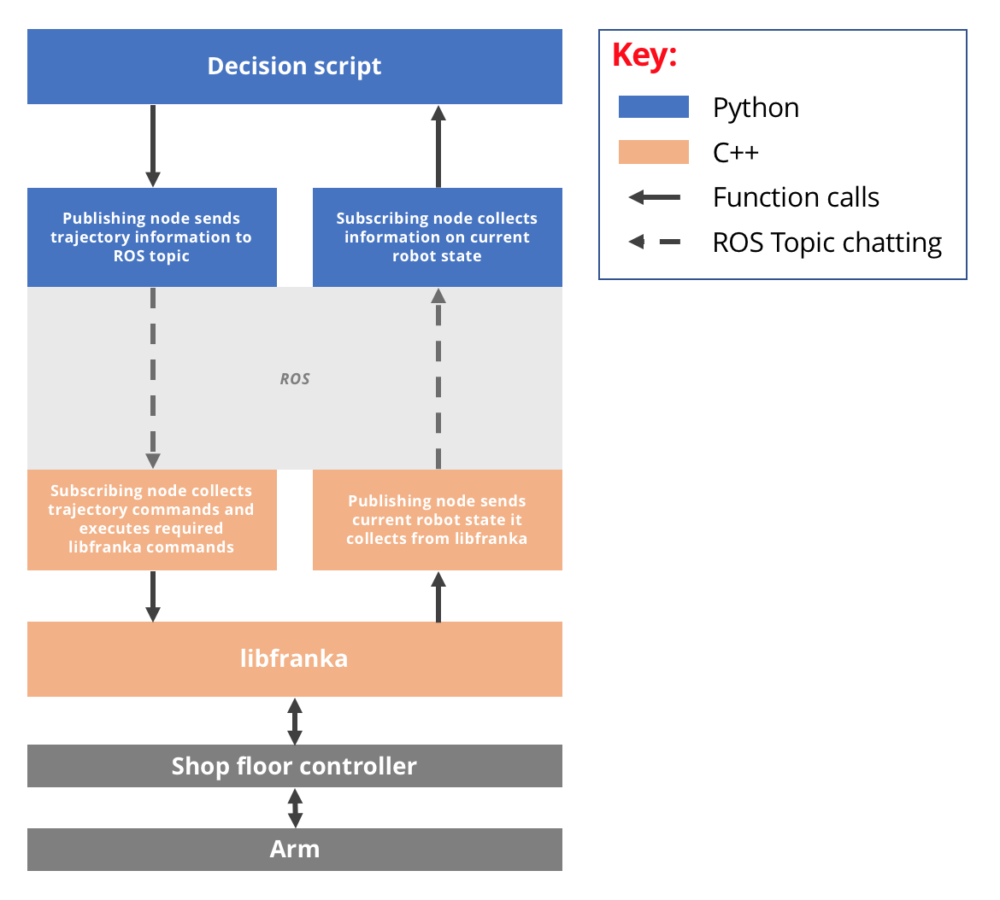

*******************
Operating the Robot
*******************

.. note::
  This page is still incomplete.

Using the provided workstation
==============================

To log into the workstation:

* Username: ``robin``
* Password: ``deniro``

.. note::
  If you do not use a provided workstation, ensure you have completed all the steps in the :doc:`workstation` page.

Starting up FRANKA
==================

Connect your workstation to the network via ethernet. Power up the FRANKA and when booted (solid yellow), type the following into the URL bar in a browser::

  http://192.168.0.88

Now run through the unlocking procedure as described in the :doc:'franka' doc.

Understanding how to control the FRANKA
=======================================

Current method
--------------

The current method to control the Franka is via a custom executable C++ file written by Fabian and Petar. Once you download the file you can execute it on the command line and pass in vector arguments. You can either download it using this `link to the raw file`_, or run the following command in the directory you want the file::

  cd <desired_directory>
  wget https://raw.githubusercontent.com/nebbles/DE3-ROB1-CHESS/master/franka/robotics1-velocityGenerator.cpp

.. _`link to the raw file`: https://raw.githubusercontent.com/nebbles/DE3-ROB1-CHESS/master/franka/robotics1-velocityGenerator.cpp

Go to the directory storing the C++ file (robotics1-velocityGenerator.cpp). To make it an executable run the following command::

  chmod a+x robotics1-velocityGenerator.cpp

You then need to run the executable using sudo mode::

  sudo bash
  source /opt/ros/kinetic/setup.bash

You can now run the executable::

  sudo ./robotics1-velocityGenerator 192.168.0.88 [deltaX] [deltaY] [deltaZ]

.. note::
  The author plans on maintaining a Python executable to maintain a module for controlling ``robotics1-velocityGenerator`` from Python.

Planned method
--------------

The image below describes how we plan to control the Arm using Python. To be able to write a successful Python program, we must first understand how ROS works: how to publish and listen on topics.

    Interfacing Python with FRANKA.

Getting Started with ROS
========================

.. note::
  Currently we are not using ROS to control the FRANKA Robot. So this section is only necessary to get practise in setting up a workspace.

#. In your home directory, ensure you have set up a `complete catkin workspace`_.
#. Within that workspace, `create a catkin package`_.
#. TBC...

.. _`complete catkin workspace`: http://wiki.ros.org/catkin/Tutorials/create_a_workspace
.. _`create a catkin package`: http://wiki.ros.org/ROS/Tutorials/CreatingPackage

Additional Resources
====================

https://frankaemika.github.io/docs/getting_started.html#operating-the-robot
