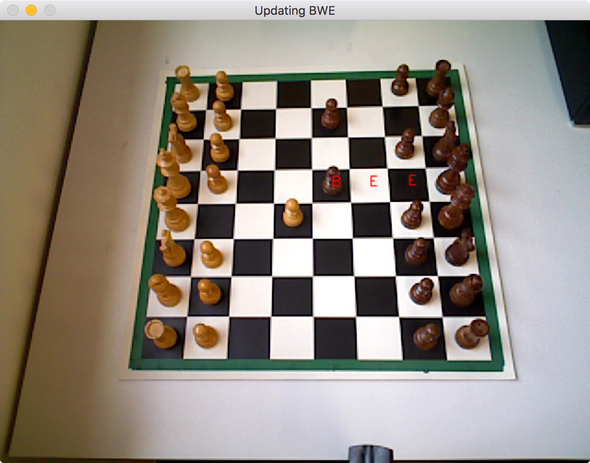

**********
Perception
**********

Description
===========

The perception module enables recognising moves made using machine vision. It is based on OpenCV3, run on Python 2.7.
It takes pictures as an input using an Asus Xtion camera and then processes these. The output of the perception module, which is subsequently
fed into the chess engine, is a Black White Empty (BWE) matrix. This matrix is returned as an 8 by 8 numpy array, filled
with a zero for empty chess squares, a one if the square is occupied by a white piece, and a two if it's occupied by
a black piece. Because the initial setup of the game is constant, this matrix is sufficient to determine the state
of the game at any time.

Design
======

The perception module is written by us and can provide all the chess functionality we need.

There are several classes, such as Line, Square, Board and Perception. The code works in the following sequence:

1. A picture of an empty board is taken and its grid is determined. 64 Square instances are generated, each holding
information about the position of the square, its current state (at this stage they are all empty), and the centres of
the squares. The 64 squares are held in a Board instance, holding all the information about the current state of the game.
The Board instance is stored in a Perception instance, representing all of the perception engine.

2. The chessboard is populated by the user in the usual chess setup. The initial BWE matrix is assigned, looking like this:

|  ``B B B B B B B B``
|  ``B B B B B B B B``
|  ``E E E E E E E E``
|  ``E E E E E E E E``
|  ``E E E E E E E E``
|  ``E E E E E E E E``
|  ``W W W W W W W W``
|  ``W W W W W W W W``

3. When the user has made his or her move, a keyboard key is pressed. This triggers a new picture to be taken and compared
to the previous one. The squares that have changed (i.e. a piece has been moved from or to) are analysed in terms of their
RGB colors and assigned a new state based thereupon. The BWE matrix is updated and passed to the chess engine, for instance to:

|  ``B B B B B B B B``
|  ``B B B B B B B B``
|  ``E E E E E E E E``
|  ``E E E E E E E E``
|  ``E E E E W E E E``
|  ``E E E E E E E E``
|  ``W W W W E W W W``
|  ``W W W W W W W W``

4. The chess engine determines the best move to make and the robot executes it. The user then needs to press the keyboard again
to update the BWE to include the opponent's (robot) move. Upon pressing a key, the BWE might look like this.

|  ``B B B B B B B B``
|  ``B B B B E B B B``
|  ``E E E E E E E E``
|  ``E E E E B E E E``
|  ``E E E E W E E E``
|  ``E E E E E E E E``
|  ``W W W W E W W W``
|  ``W W W W W W W W``

5. Return to step 3.

Machine Vision
==============

This section is concerned with how the machine vision works that achieves perception

.. figure:: _static/perception_1_threshold.png
    :align: center
    :figwidth: 30 em
    :figclass: align-center

.. figure:: _static/perception_2_filtering.png
    :align: center
    :figwidth: 30 em
    :figclass: align-center

.. figure:: _static/perception_3_masking.png
    :align: center
    :figwidth: 30 em
    :figclass: align-center

.. figure:: _static/perception_4_canny.png
    :align: center
    :figwidth: 30 em
    :figclass: align-center

.. figure:: _static/perception_5_hough.png
    :align: center
    :figwidth: 30 em
    :figclass: align-center

.. figure:: _static/perception_6_classified.png
    :align: center
    :figwidth: 30 em
    :figclass: align-center

.. figure:: _static/perception_7_bwe.png
    :align: center
    :figwidth: 30 em
    :figclass: align-center

Limitations
===========

This perception module has limitations, which are mostly in terms of robustness and setup. With more coding effort it should
be able to recognise the chessboard grid even if it is populated.

Implementation
==============

**Documentation**:

.. automodule:: perception.lineClass
  :members:
  :undoc-members:

.. automodule:: perception.squareClass
  :members:
  :undoc-members:

.. automodule:: perception.boardClass
  :members:
  :undoc-members:

.. automodule:: perception.mainDetect
  :members:
  :undoc-members: