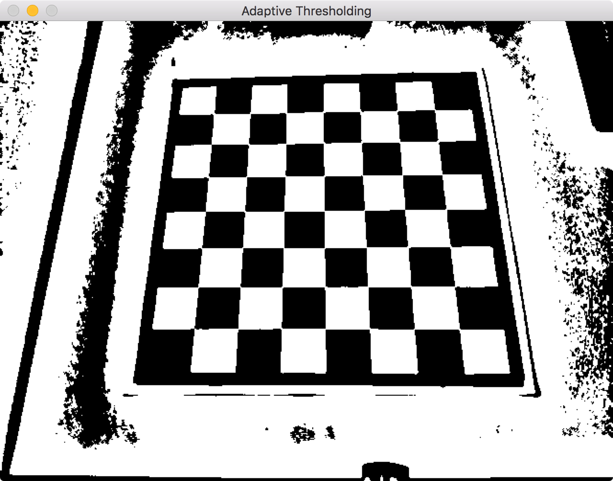
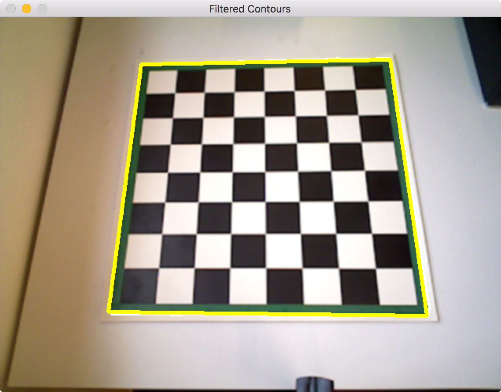
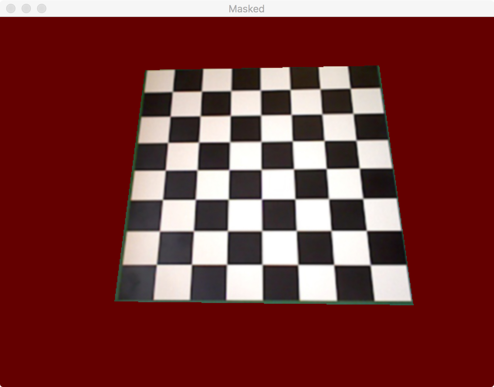
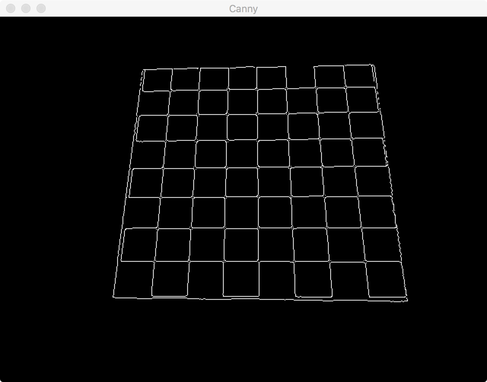
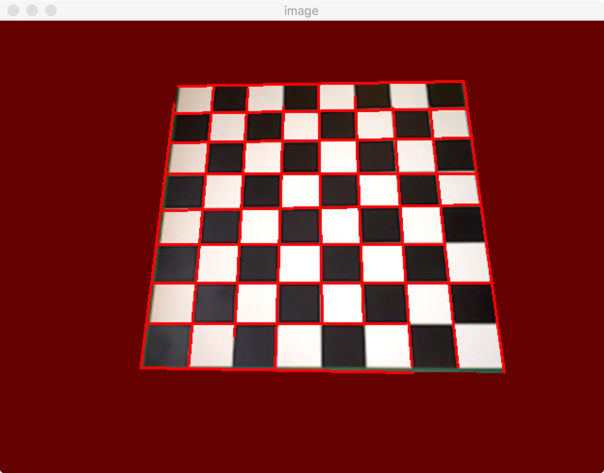
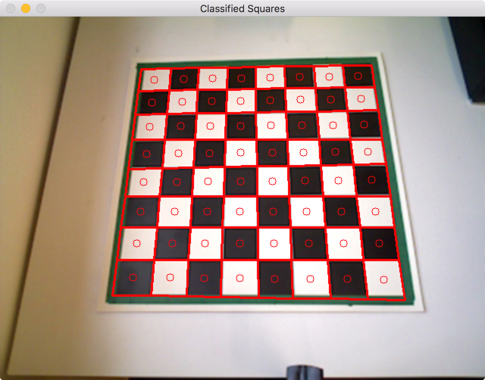
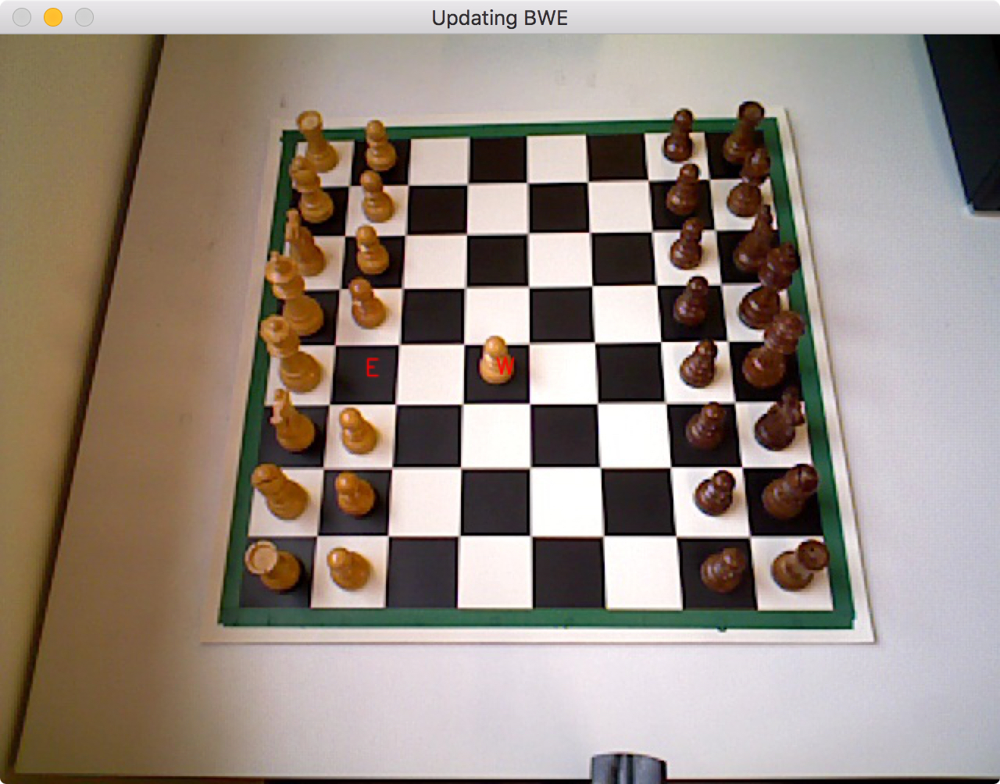

**********
Perception
**********

Description
===========

The perception module enables chess moves to be recognised using machine vision. It is based on OpenCV and runs on Python 2.7.
An Asus Xtion camera provides frames as an input, which are then processed by the perception engine.
It outputs a Black White Empty (BWE) matrix that is then passed on to the chess engine. This matrix is returned as a nested list, filled
with 'E' for empty chess squares, 'W' if the square is occupied by a white piece, and 'B' if it's occupied by
a black piece. As the initial setup of the chess pieces is constant, this matrix is sufficient to determine the state of the game at any time.

Design
======

There are several classes such as Line, Square, Board and Perception within the pereption module. The code works in the following sequence:

1)
A picture of an empty board is taken and its grid is determined. 64 Square instances are generated, each holding information about the position of the square, its current state (at this stage they are all empty), and color properties of the square. The 64 squares are stored in a Board instance, holding all the information about the current state of the game. The Board instance is stored in a Perception instance, representing the perception engine in its entirety and facilitating access from other modules.

2)
The chessboard is populated by the user in the usual setup. The initial BWE matrix is assigned, looking like this:

|  ``B B B B B B B B``
|  ``B B B B B B B B``
|  ``E E E E E E E E``
|  ``E E E E E E E E``
|  ``E E E E E E E E``
|  ``E E E E E E E E``
|  ``W W W W W W W W``
|  ``W W W W W W W W``
|

3)
When the user has made his or her move, a keyboard key is pressed. This triggers a new picture to be taken and compared to the previous one. The squares that have changed (i.e. a piece has been moved from or to) are analysed in terms of their RGB colors and assigned a new state based thereupon. The BWE matrix is updated and passed to the chess engine, for instance to:

|  ``B B B B B B B B``
|  ``B B B B B B B B``
|  ``E E E E E E E E``
|  ``E E E E E E E E``
|  ``E E E E W E E E``
|  ``E E E E E E E E``
|  ``W W W W E W W W``
|  ``W W W W W W W W``
|

4)
The chess engine determines the best move to make and the robot executes it. The user then needs to press the keyboard again to update the BWE to include the opponent's (robot) move. Upon pressing a key, the BWE might look like this:

|  ``B B B B B B B B``
|  ``B B B B E B B B``
|  ``E E E E E E E E``
|  ``E E E E B E E E``
|  ``E E E E W E E E``
|  ``E E E E E E E E``
|  ``W W W W E W W W``
|  ``W W W W W W W W``
|

5)
Return to step 3. The loop continues until the game ends.

Machine Vision
==============

This section is concerned with how the machine vision works that achieves perception.

Thresholding, Filtering and Masking
-----------------------------------

The first stage of image analysis takes care of thresholding, filtering and masking the chessboard. Adaptive thresholding is used to subsequently do contour detection, concerned with detecting the board edges.

A filter looks for squares within the image and filters the largest one, the chessboard. This was achieved by looking at the largest contour within the image that had a ratio of area to perimeter typical for a square.

The chessboard is masked and the rest of the image is replaced with a homogeneous color. We chose red for this purpose, as it was a color which did not interfere with other colors in the image.

Determining the chess corners and squares
-----------------------------------------

Canny edge detection is needed to determine Hough lines. It is an algorithm consisting of various stages of filtering, intensity gradient calculations, thresholding and suppression to identify edges. As shown below, it aids with identifying the chess grid.

Hough lines are subsequently calculated from the Canny image. Lines are identified and instantiated with their gradients and positions. At that stage, similar lines are sometimes clustered together, so gradient filtering is applied to minimise the number of lines without losing the ones needed.

Intersections of Hough lines are found by equating two lines and solving. As there are still some duplicates, an algorithm now does the final filtering to ensure that only 81 points remain. The corner points (9 x 9) are assigned to rows and columns within the chessboard. 64 (8 x 8) Square instances are then generated. Each holds information about its position, index, and color average within the ROI area (shown as a circle in its centre). When the game is setup, the latter is the square's 'empty color', i.e. black or white.

.. literalinclude:: ../../perception/squareClass.py
   :lines: 5-40

The board can now be instantiated as a collection of all the squares. The sequence of functions called to generate the board is called within the makeBoard function, shown below:

.. literalinclude:: ../../perception/mainDetect.py
   :lines: 33-78

Updating the BWE matrix
-----------------------

When a piece is moved, the code detects changes between the previous and the current image. The centres of the bounding boxes surrounding that change region are matched with the squares. Two squares will be detected to have changed, as the centres of the change regions lie within them. A piece has been either moved from or to that square.

Both squares current Region of Interest (ROI) colors are taken and compared against their 'empty colors', i.e. their colors when not occupied by a piece. This distance is quantified by a 3-dimensional RGB color distance. The one with the smaller distance to its empty state must currently be an empty square, meaning a piece has been moved from it. Its old state (when the piece still was there) is saved temporarily, while its state is reassigned as empty. The non-empty square now takes the state of the piece that has been moved to it, i.e. the empty square's old state.

.. literalinclude:: ../../perception/boardClass.py
   :lines: 45-75

Limitations
===========

This perception module has limitations, which are mostly in terms of robustness and setup. With further development it should be able to recognise the chessboard grid even if it is populated. Changing light conditions make the perception engine very unstable, as the classification of states of chess squares relies on a constant light setting. There are still many improvements that can be made in terms of integrating the perception engine with the chess engine and the motion generation. There are inconsistencies with storing the BWE as a numpy array or as a nested list. Finally, this perception engine relies on having an image of the empty board first. 

Please contact Paolo Rüegg under pfr15@ic.ac.uk in case you would like to continue working on this and require further information about this code.

Implementation
==============

**Documentation**:

.. automodule:: perception.mainDetect
  :members:
  :undoc-members:

.. automodule:: perception.boardClass
  :members:
  :undoc-members:

.. automodule:: perception.squareClass
  :members:
  :undoc-members:

.. automodule:: perception.lineClass
  :members:
  :undoc-members:
