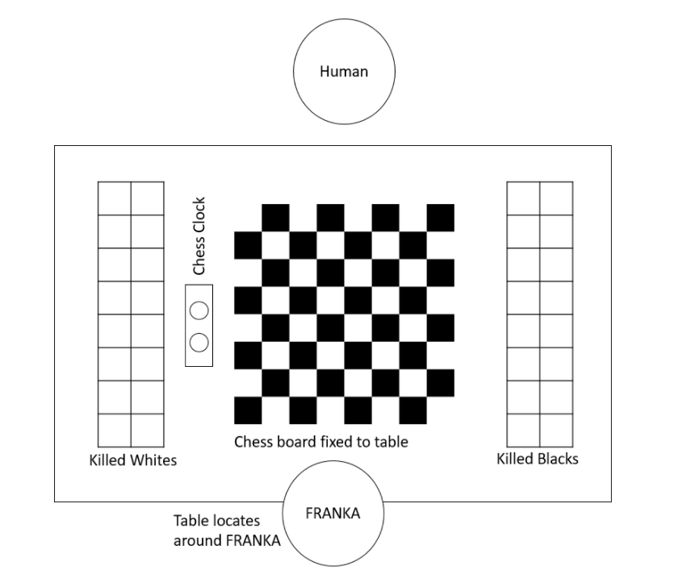
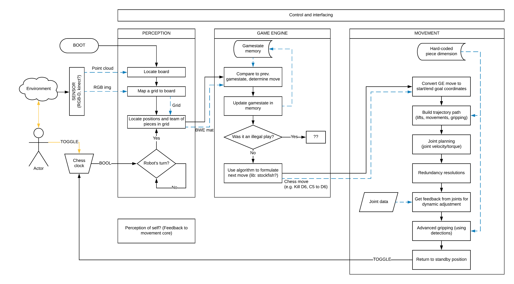

************
Project Plan
************

Requirements
============

* **Sketch of a scenario:**

* **Flow chart of the sequence:**

|  1. Starting the game
|     a. Set up game pieces
|  2. Playing the game
|     a. Completing a move
|     b. Timing the move
|     c. Removing pieces
|     d. Replacing pieces
|  3. Ending the game
|     a. Relocating pieces to initial positions
|

Resources
=========

* **Confirmed:**

  * FRANCA
  * Chessboard
  * Chess Pieces (custom to start with)
  * Camera (RGB-D, MS Kinect?)
  * Chess clock

* **Maybe:**

  * Sensors for end-effector (force detection, IMU?)
  * Customised chess board

Work Breakdown Structure
========================

Each person’s key areas of interest and work division and summarised in the table below:

=====================  =============================  ==================================
Area of work           Starting teams (lead in bold)  Change in teams
=====================  =============================  ==================================
Documentation          **Ben**                        Ben
Physical build         **Sanish**, Paolo, Anna        *n/a - (expected completed first)*
Perception             **Leah**, Paolo                Leah, Paolo
Game Engine            **Josephine**, Ben             *n/a - (expected completed first)*
Movement               **Anna**, Sanish, Sylvia       Josephine, Anna, Sanish, Sylvia
Interface/Controller*  Ben                            Ben
=====================  =============================  ==================================

*\*implemented later on*

Gantt Chart
===========

The Gantt chart is dynamic and can be viewed here: https://docs.google.com/spreadsheets/d/1-BJZdqYe8wWnCwUJs8sGYKyAoFGYXU7qOBCCHt1B_Ek/edit?usp=sharing

Implementation
==============

The hardware/software/component approaches to this project will be developed out further with modifications to this system diagram. This will come over the next few weeks.

Expected Difficulties
=====================

.. list-table::
  :header-rows: 1

  * - Difficulty
    - Mitigation strategy
  * - Gripping outsized pieces (e.g. knight)
    - Standardised grip geometry at the bottom of each piece
  * - Positional drift of chess pieces
    - Perception (active) and gripping (passive) system that can mitigate against drift
  * - Large RGB-D tolerances leading to board misalignment
    - Maintain fixed board location
  * - Integrating the game engine with the motion control
    - Dedicated project director and clear code structure
  * - Reliably identifying board in a darker environment
    - Set up lighting rig to illuminate area
  * - Grid assignment misaligning on boot
    - Maintain fixed board location
  * - User does not remember to press chess clock
    - Time-out beeper, game manual

Risk Assessment & Safety Plan
=============================

In the FRANKA user manual, pages 62-86 describe an extensive risk assessment.
